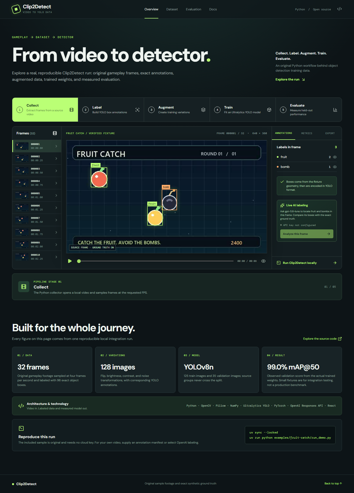
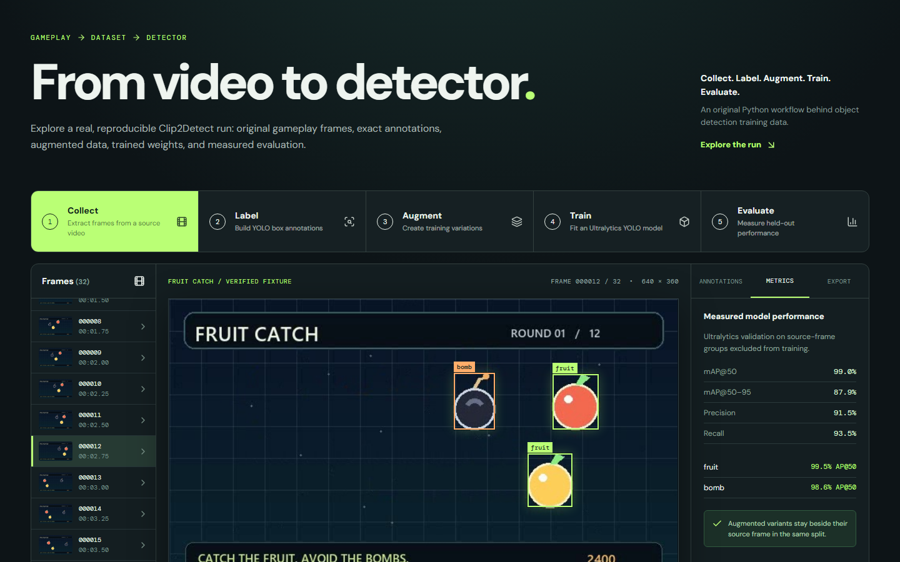
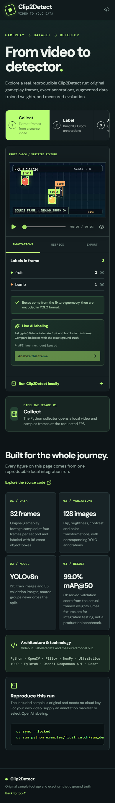

<div align="center">


<br/>

# 🎮 Clip2Detect

### **Turn Gameplay Video into a Trained YOLO Object Detector — End-to-End, in Minutes**

<p align="center">
  <a href="https://clip2detect.vercel.app/"></a>
  <a href="https://github.com/9059Rohith/Clip2Detect"></a>
  <a href="https://github.com/9059Rohith/Clip2Detect/blob/main/LICENSE"></a>
</p>

<p align="center">
  
  
  
  
  
  
  
</p>

<p align="center">
  <strong>
    <a href="https://clip2detect.vercel.app/">🌐 Live Demo</a> ·
    <a href="#-demo-video">🎬 Demo Video</a> ·
    <a href="docs/poster/clip2detect-poster.png">🖼️ Poster</a> ·
    <a href="#-quick-start">🚀 Quick Start</a> ·
    <a href="#-architecture">🏗️ Architecture</a> ·
    <a href="#-results">📊 Results</a> ·
    <a href="#-api-reference">📖 API Reference</a>
  </strong>
</p>

---

> **Clip2Detect** is an end-to-end ML pipeline that samples frames from a local video, labels every frame (via a JSON manifest **or** GPT-5.6 Luna vision), augments the dataset, trains a YOLOv8 object detector, and surfaces all results — frames, labels, live AI comparisons, and model metrics — in a polished React browser app, all deployed on Vercel.

</div>

---

## 📋 Table of Contents

- [🎬 Demo Video](#-demo-video)
- [✨ Features](#-features)
- [📊 Results & Benchmarks](#-results--benchmarks)
- [🏗️ Architecture](#-architecture)
- [🚀 Quick Start](#-quick-start)
- [📖 CLI Reference](#-cli-reference)
- [⚙️ Configuration & Options](#-configuration--options)
- [🗂️ Project Structure](#-project-structure)
- [🔬 How It Works](#-how-it-works)
- [🌐 Live Application](#-live-application)
- [🧪 Testing](#-testing)
- [🔧 Tech Stack](#-tech-stack)
- [🤝 Contributing](#-contributing)
- [📜 License](#-license)

---

## 🎬 Demo Video

<div align="center">

[](https://clip2detect.vercel.app/)

> **📹 Full narrated walkthrough** — See the complete pipeline in action: video sampling → GPT-5.6 labeling → YOLOv8 training → live browser inspection with real-time AI comparison.

*A browser-recorded, narrated, and subtitled demo is generated by [`docs/demo/make_demo.py`](docs/demo/make_demo.py) using Playwright + Edge neural TTS + FFmpeg. To regenerate the recording locally, configure the live AI endpoint (see [Live Application](#-live-application)) and run:*

```bash
uv run --extra demo python docs/demo/make_demo.py
```

</div>

---

## ✨ Features

| Feature | Description |
|---|---|
| 🎮 **Video Frame Sampling** | Extracts frames from any local MP4 at a configurable FPS using OpenCV |
| 🏷️ **Dual Labeling Modes** | Use a precise **JSON manifest** or **GPT-5.6 Luna vision** via OpenAI Responses API |
| 🔄 **Smart Augmentation** | Generates horizontal flip, brightness, contrast & noise variants with correct box transforms |
| 🧠 **Train/Val Split Isolation** | Keeps all variants of a source frame in the **same** partition — preventing data leakage |
| 🚀 **YOLOv8 Training** | Trains Ultralytics YOLOv8n and evaluates saved `best.pt` weights automatically |
| 📊 **Full Evaluation** | Produces mAP@50, mAP@50–95, per-class AP, precision, and recall as a JSON report |
| 🌐 **Browser Viewer** | React + TypeScript + Vite SPA for browsing frames, labels, AI comparison, metrics & downloads |
| 🤖 **Live AI Comparison** | Vercel serverless function calls GPT-5.6 Luna per-frame; dashed overlays compare with ground truth |
| 🔒 **Secure by Design** | API key never sent to the browser; all secrets stay in Vercel Production environment variables |

---

## 📊 Results & Benchmarks

The included **Fruit Catch** sample is an original generated gameplay video. Ground-truth boxes come from the generator's own drawing coordinates, guaranteeing pixel-perfect annotations.

<div align="center">

| Metric | Value |
|---|---:|
| 📹 Source video | 8 seconds · 640 × 360 · 4 FPS |
| 🖼️ Sampled frames / exact boxes | 32 / 96 |
| 🔄 Augmented images | 128 |
| 📂 Train / Validation images | 125 / 35 |
| 🤖 Model / Epochs | YOLOv8n / 6 |
| ✅ **Validation mAP@50** | **99.0%** |
| ✅ **Validation mAP@50–95** | **87.9%** |
| 📈 **Precision / Recall** | **91.5% / 93.5%** |

</div>

> **Note:** These figures describe this controlled sample. On arbitrary video footage with noisier annotations the numbers will vary. The live GPT comparison runs independently and is **not** used to calculate the reported training metrics.

Raw data lives in:
- [`site/public/sample/eval_results.json`](site/public/sample/eval_results.json) — full evaluation JSON
- [`site/public/sample/best.pt`](site/public/sample/best.pt) — trained YOLO weights

---

## 🏗️ Architecture

```
┌──────────────────────────────────────────────────────────────────────┐
│                         CLIP2DETECT PIPELINE                         │
└──────────────────────────────────────────────────────────────────────┘

   Local Video (MP4)
        │
        ▼
┌──────────────┐     OpenCV          ┌─────────────────┐
│  Frame        │ ──────────────────► │  Sampled Frames │
│  Sampling     │  @ configurable FPS │  (JPEG, 95 qual)│
└──────────────┘                     └────────┬────────┘
                                              │
                              ┌───────────────┼───────────────┐
                              │               │               │
                    ┌─────────▼──────┐        │      ┌────────▼───────┐
                    │  JSON Manifest │        │      │  GPT-5.6 Luna  │
                    │  (exact boxes) │        │      │  Vision API    │
                    └─────────┬──────┘        │      └────────┬───────┘
                              └───────────────┼───────────────┘
                                              ▼
                                    ┌──────────────────┐
                                    │   YOLO Labels    │
                                    │  (.txt per frame)│
                                    └────────┬─────────┘
                                             │
                                             ▼
                                    ┌──────────────────┐
                                    │   Augmentation   │
                                    │  Flip · Bright · │
                                    │  Contrast · Noise│
                                    └────────┬─────────┘
                                             │
                                             ▼
                              ┌──────────────────────────┐
                              │  Train/Val Dataset Split  │
                              │  (group-isolated, 80/20)  │
                              └─────────────┬────────────┘
                                            │
                                            ▼
                                   ┌─────────────────┐
                                   │  YOLOv8n Train  │
                                   │  (Ultralytics)  │
                                   └────────┬────────┘
                                            │
                                            ▼
                                   ┌─────────────────┐
                                   │  Evaluate       │
                                   │  best.pt weights│
                                   └────────┬────────┘
                                            │
                        ┌───────────────────┼───────────────────┐
                        ▼                   ▼                   ▼
               ┌──────────────┐    ┌───────────────┐   ┌──────────────┐
               │  eval_results│    │   best.pt     │   │  React Viewer│
               │  .json       │    │   weights     │   │  (Vercel)    │
               └──────────────┘    └───────────────┘   └──────────────┘
```

### Component Overview

| Component | Location | Role |
|---|---|---|
| `pipeline.py` | `clip2detect/pipeline.py` | Core ML pipeline: collect → label → augment → dataset → train → evaluate |
| `cli.py` | `clip2detect/cli.py` | `argparse` CLI entry point |
| `run_demo.py` | `examples/fruit-catch/` | End-to-end demo runner (generates video + ground truth + trains) |
| `publish_site_data.py` | `examples/fruit-catch/` | Exports run artifacts into the React site's public folder |
| React SPA | `site/` | Vite + TypeScript browser viewer with Vercel serverless API |
| Tests | `tests/` | Unit tests (pipeline) + smoke tests (browser/site) |

---

## 🚀 Quick Start

### Prerequisites

| Tool | Version | Purpose |
|---|---|---|
| [Python](https://python.org) | 3.11+ | Pipeline runtime |
| [uv](https://docs.astral.sh/uv/) | Latest | Ultra-fast Python package manager |
| [Node.js](https://nodejs.org) | 20+ | React viewer dev server |
| PyTorch-compatible hardware | CPU/GPU | Model training (GPU optional but faster) |

### 1. Clone & Install

```bash
git clone https://github.com/9059Rohith/Clip2Detect.git
cd Clip2Detect
uv sync --locked
```

### 2. Run the Included Fruit Catch Demo

This single command generates its own video, creates pixel-perfect ground-truth labels, samples frames, augments, trains YOLOv8, and evaluates:

```bash
uv run python examples/fruit-catch/run_demo.py
```

All outputs land in `runs/fruit-catch-demo/`.

### 3. Export Artifacts to the Browser Site

```bash
uv run python examples/fruit-catch/publish_site_data.py
```

### 4. Launch the React Viewer

```bash
cd site
npm ci
npm run dev
```

Open [http://localhost:5173](http://localhost:5173) — browse frames, labels, evaluation metrics, and live AI comparisons.

---

## 📖 CLI Reference

### Basic Usage

```
uv run python -m clip2detect <video> --classes <cls1,cls2,...> [OPTIONS]
```

### Labeling from a JSON Manifest (Exact Boxes)

```bash
uv run python -m clip2detect path/to/video.mp4 \
  --classes fruit,bomb \
  --manifest path/to/boxes.json \
  --output runs/my-run
```

### Labeling with GPT-5.6 Luna Vision (AI Auto-Label)

```bash
export OPENAI_API_KEY=sk-...

uv run python -m clip2detect path/to/video.mp4 \
  --classes fruit,bomb \
  --openai \
  --output runs/my-run
```

> ⚠️ **Always inspect AI-generated boxes** before using them as training data. The vision model may produce imprecise or noisy annotations on complex footage.

### Overwrite an Existing Run

```bash
uv run python -m clip2detect path/to/video.mp4 \
  --classes fruit,bomb \
  --manifest boxes.json \
  --output runs/my-run \
  --overwrite
```

---

## ⚙️ Configuration & Options

| Argument | Type | Default | Description |
|---|---|---|---|
| `video` | `Path` | *(required)* | Local video file path |
| `--classes` | `str` | *(required)* | Comma-separated class names, e.g. `fruit,bomb` |
| `--manifest` | `Path` | `None` | JSON annotation manifest (mutually exclusive with `--openai`) |
| `--openai` | flag | `False` | Use GPT-5.6 Luna vision for auto-labeling |
| `--output` | `Path` | `runs/custom` | Directory to write all pipeline outputs |
| `--fps` | `float` | `4` | Frames per second to sample from the video |
| `--epochs` | `int` | `6` | Number of YOLOv8 training epochs |
| `--image-size` | `int` | `320` | Training image size (pixels) |
| `--batch` | `int` | `8` | Batch size for training and validation |
| `--model` | `str` | `yolov8n.pt` | Ultralytics model checkpoint to start from |
| `--overwrite` | flag | `False` | Replace existing outputs in the selected directory |

### Environment Variables

| Variable | Required | Description |
|---|---|---|
| `OPENAI_API_KEY` | When using `--openai` | Your OpenAI API key for GPT-5.6 Luna vision labeling |
| `OPENAI_LABEL_MODEL` | Optional | Override the vision model (default: `gpt-5.6-luna`) |
| `CLIP2DETECT_SITE_URL` | Optional (smoke tests) | Override the base URL for browser smoke tests |

---

## 🗂️ Project Structure

```
Clip2Detect/
├── clip2detect/               # Core Python package
│   ├── __init__.py
│   ├── __main__.py            # python -m clip2detect entry point
│   ├── cli.py                 # argparse CLI interface
│   └── pipeline.py            # Full ML pipeline (collect→label→augment→train→eval)
│
├── examples/
│   └── fruit-catch/           # Built-in end-to-end sample
│       ├── run_demo.py        # Generates video + runs full pipeline
│       ├── publish_site_data.py # Exports artifacts to site/public/sample/
│       ├── create_fixture.py  # Procedural video + ground-truth generator
│       ├── ground_truth.json  # Exact pixel-level bounding boxes (96 objects)
│       ├── input.mp4          # Generated gameplay video (8 sec, 640×360)
│       └── config.json        # Demo configuration
│
├── docs/
│   ├── poster/
│   │   └── clip2detect-poster.png  # Project poster (full resolution)
│   ├── screenshots/
│   │   ├── desktop-overview.png
│   │   ├── evaluation.png
│   │   ├── live-ai.png
│   │   └── mobile-overview.png
│   └── demo/
│       └── make_demo.py       # Playwright + TTS demo recording script
│
├── site/                      # React + TypeScript viewer (Vite)
│   ├── src/                   # Component source
│   ├── api/                   # Vercel serverless functions (GPT live compare)
│   ├── public/sample/         # Exported pipeline artifacts served to browser
│   └── .env.example           # Example env file (no credentials)
│
├── tests/
│   ├── test_pipeline.py       # Unit tests: collect, label, augment, dataset, train
│   └── site_smoke.py          # Browser smoke tests via Playwright
│
├── runs/                      # Pipeline outputs (gitignored)
├── pyproject.toml             # Project metadata + dependencies (uv / hatchling)
├── uv.lock                    # Locked dependency tree
├── yolov8n.pt                 # Base YOLOv8n weights
└── LICENSE                    # MIT
```

---

## 🔬 How It Works

### Stage 1 — Frame Collection (`collect`)

OpenCV opens the source video and samples one frame every `1/fps` seconds of elapsed video time. Each frame is written as a high-quality JPEG (95%) to `{output}/frames/`. At least two frames are required.

### Stage 2 — Annotation (`label`)

**Mode A — JSON Manifest:** A manifest file maps each frame number to a list of `{"class": "...", "xyxy": [x1,y1,x2,y2]}` objects. Coordinates are validated against image dimensions and converted to YOLO's normalized `cx cy w h` format.

**Mode B — GPT-5.6 Luna Vision:** Each frame is base64-encoded and sent to the OpenAI Responses API with a structured JSON-schema output format. The model returns tight bounding boxes for the requested class names, which are then validated and converted. Results are written as `.txt` label files alongside each frame.

### Stage 3 — Augmentation (`augment`)

For every source frame, four variants are generated:
- **Flip** — horizontal mirror; X-coordinates are reflected (`cx → 1 - cx`)
- **Brightness** — `±20%` random brightness adjustment (Pillow `ImageEnhance`)
- **Contrast** — `±20%` random contrast adjustment
- **Noise** — Gaussian pixel noise (σ = 10, clipped to `[0, 255]`)

Labels are copied as-is for photometric augmentations; flip transforms bounding boxes correctly.

### Stage 4 — Dataset Construction (`make_dataset`)

All variants of the same source frame are grouped together. Groups are shuffled with a fixed seed and split `80/20` into train/validation. This **group-isolated split** guarantees that a source frame and all its augmented copies always land in the same partition, preventing data leakage. A `dataset.yaml` is written for Ultralytics.

### Stage 5 — Training & Evaluation (`train_and_evaluate`)

Ultralytics `YOLO` trains with the supplied config. The best checkpoint (`best.pt`) is copied to `{output}/weights/`. A separate validation run on the held-out set produces:
- mAP@50 and mAP@50–95
- Per-class Average Precision
- Macro precision and recall

Results are saved as `eval_results.json` and printed to stdout.

---

## 🌐 Live Application

| Resource | Link |
|---|---|
| 🌐 Live Viewer | [clip2detect.vercel.app](https://clip2detect.vercel.app/) |
| 🎬 Demo Video | [Watch the narrated walkthrough](https://clip2detect.vercel.app/) |
| 🖼️ Poster (full resolution PNG) | [docs/poster/clip2detect-poster.png](docs/poster/clip2detect-poster.png) |
| 🖥️ Screenshot — Desktop Overview | [docs/screenshots/desktop-overview.png](docs/screenshots/desktop-overview.png) |
| 📊 Screenshot — Evaluation Panel | [docs/screenshots/evaluation.png](docs/screenshots/evaluation.png) |
| 🤖 Screenshot — Live AI Comparison | [docs/screenshots/live-ai.png](docs/screenshots/live-ai.png) |
| 📱 Screenshot — Mobile View | [docs/screenshots/mobile-overview.png](docs/screenshots/mobile-overview.png) |
| ⚖️ Trained Weights (best.pt) | [clip2detect.vercel.app/sample/best.pt](https://clip2detect.vercel.app/sample/best.pt) |
| 📈 Evaluation JSON | [clip2detect.vercel.app/sample/eval_results.json](https://clip2detect.vercel.app/sample/eval_results.json) |

### Live AI Feature Setup

The **"Analyze this frame"** button in the viewer triggers a Vercel serverless function that calls GPT-5.6 Luna with only a frame number — **the API key never leaves the server**. To enable it on your own deployment:

1. Go to your `clip2detect` Vercel project → **Settings** → **Environment Variables**
2. Add `OPENAI_API_KEY` to the **Production** environment
3. Redeploy the project

Dashed box overlays (AI result) are drawn beside solid overlays (ground truth) for direct visual comparison.

---

## 🧪 Testing

### Python Unit Tests

```bash
uv run python -m unittest discover -s tests -p "test_*.py" -v
```

Covers: box encoding, source-group split isolation, API response handling, augmentation correctness, and train/val set construction.

### Site Build & API Tests

```bash
cd site
npm ci
npm run test:api
npm run build
```

### Browser Smoke Tests (Playwright)

Run against the live deployment or a local dev server:

```bash
# Against live app (default)
uv run --extra demo python tests/site_smoke.py

# Against local dev server
CLIP2DETECT_SITE_URL=http://localhost:5173 uv run --extra demo python tests/site_smoke.py
```

Checks: desktop and mobile controls, artifact downloads, frame navigation, and live AI comparison panel.

---

## 🔧 Tech Stack

### Python Pipeline

| Library | Version | Role |
|---|---|---|
| [Python](https://python.org) | 3.11+ | Core runtime |
| [OpenCV](https://opencv.org/) | 4.8+ | Video decoding and frame extraction |
| [Pillow](https://pillow.readthedocs.io/) | 10.0+ | Image augmentation (brightness, contrast, noise) |
| [NumPy](https://numpy.org/) | 1.24+ | Pixel-level array operations |
| [PyYAML](https://pyyaml.org/) | 6.0+ | YOLO dataset YAML generation |
| [Ultralytics](https://ultralytics.com/) | 8.0+ | YOLOv8 training and evaluation |
| [OpenAI Responses API](https://platform.openai.com/) | — | GPT-5.6 Luna structured vision output |

### Demo & Recording (optional)

| Library | Role |
|---|---|
| [Playwright](https://playwright.dev/python/) | Browser automation for demo recording |
| [edge-tts](https://github.com/rany2/edge-tts) | Neural narration via Microsoft Edge TTS |
| [imageio-ffmpeg](https://github.com/imageio/imageio-ffmpeg) | FFmpeg integration for final MP4 encoding |
| [mutagen](https://mutagen.readthedocs.io/) | Audio duration reading |

### Frontend

| Tool | Role |
|---|---|
| [React](https://react.dev/) + [TypeScript](https://typescriptlang.org/) | Component-based browser viewer |
| [Vite](https://vitejs.dev/) | Lightning-fast dev server and build tool |
| [Vercel](https://vercel.com/) | Static site hosting + serverless function runtime |

---

## 📸 Screenshots

<table>
  <tr>
    <td align="center"><b>Desktop Overview</b></td>
    <td align="center"><b>Evaluation Panel</b></td>
  </tr>
  <tr>
    <td></td>
    <td></td>
  </tr>
  <tr>
    <td align="center"><b>Live AI Comparison</b></td>
    <td align="center"><b>Mobile View</b></td>
  </tr>
  <tr>
    <td></td>
    <td></td>
  </tr>
</table>

---

## 🤝 Contributing

Contributions, issues and feature requests are welcome! Please:

1. **Fork** the repository
2. **Create** your feature branch: `git checkout -b feature/amazing-feature`
3. **Commit** your changes: `git commit -m 'feat: add amazing feature'`
4. **Push** to the branch: `git push origin feature/amazing-feature`
5. **Open a Pull Request** against `main`

### Development Setup

```bash
# Install all dependencies including demo extras
uv sync --locked --extra demo

# Install Playwright browsers (for smoke tests and demo recording)
uv run playwright install chromium
```

### Code Style

- Python: follow the existing style (type annotations, docstrings, no external formatters enforced)
- Keep each pipeline stage (`collect`, `label`, `augment`, `make_dataset`, `train_and_evaluate`) in `pipeline.py` independently testable
- New CLI flags should have a corresponding unit test in `tests/test_pipeline.py`

---

## 📜 License

Clip2Detect's application code, sample footage, and artwork are licensed under the **MIT License** — see [`LICENSE`](LICENSE) for the full text.

Third-party dependencies (PyTorch, Ultralytics, OpenCV, React, etc.) and the pre-trained YOLOv8n weights retain their own respective licenses and authorship.

---

## 👤 Author

**9059Rohith** — built with Codex assistance.

- GitHub: [@9059Rohith](https://github.com/9059Rohith)
- Live Project: [clip2detect.vercel.app](https://clip2detect.vercel.app/)

---

<div align="center">

**⭐ If Clip2Detect helped you, please consider starring the repository!**

[](https://github.com/9059Rohith/Clip2Detect)

*Made with ❤️ and a lot of bounding boxes*

</div>
