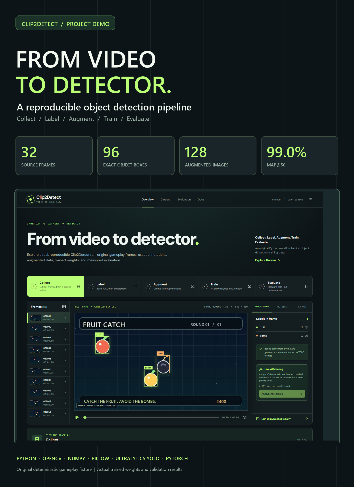

# Clip2Detect

**Clip2Detect turns gameplay video into labeled training data, trains a YOLO object detector, and lets you inspect real results in a browser.**

[Live application](https://clip2detect.vercel.app/) · [Source repository](https://github.com/9059Rohith/Clip2Detect) · [Narrated demo](docs/demo/clip2detect-demo.mp4) · [Poster](docs/poster/clip2detect-poster.png)



## What works

1. Sample frames from a local video with OpenCV.
2. Label the frames from a JSON annotation manifest or GPT-5.6 Luna vision through the OpenAI Responses API.
3. Create horizontal flip, brightness, contrast, and noise variants, transforming the boxes when needed.
4. Keep each source frame and its variants in the same train or validation partition.
5. Train Ultralytics YOLOv8n and evaluate the saved best weights.
6. Explore the frames, labels, live AI comparison, metrics, and downloads in a React viewer.

The included **Fruit Catch** sample is an original generated video. Its ground truth comes from the generator's drawing coordinates. The live GPT result is a separate comparison and is not used to calculate the reported training metrics.

| Measured sample result | Value |
| --- | ---: |
| Source video | 8 seconds, 640 × 360, 4 FPS |
| Frames / exact boxes | 32 / 96 |
| Augmented images | 128 |
| Train / validation images | 125 / 35 |
| Model / epochs | YOLOv8n / 6 |
| Validation mAP@50 | **99.0%** |
| Validation mAP@50–95 | **87.9%** |
| Precision / recall | **91.5% / 93.5%** |

These figures come from [the measured evaluation JSON](site/public/sample/eval_results.json) and [trained weights](site/public/sample/best.pt). They describe this small controlled sample, not performance on arbitrary footage.

## Try it

Requirements: Python 3.11+, [uv](https://docs.astral.sh/uv/), and enough memory for PyTorch. The browser app needs Node.js 20+.

```bash
uv sync --locked
uv run python examples/fruit-catch/run_demo.py
uv run python examples/fruit-catch/publish_site_data.py
cd site
npm ci
npm run dev
```

The full example generates its own video and labels, then extracts frames, augments, trains, evaluates, and exports the result. Its outputs are in `runs/fruit-catch-demo/`. Training runs locally in Python; the website displays the exported artifacts.

For your own local video, supply boxes in the same JSON shape as [`ground_truth.json`](examples/fruit-catch/ground_truth.json):

```bash
uv run python -m clip2detect path/to/video.mp4 --classes fruit,bomb --manifest path/to/boxes.json --output runs/my-video
```

Or use GPT-5.6 vision to label the sampled frames:

```bash
uv run python -m clip2detect path/to/video.mp4 --classes fruit,bomb --openai --output runs/my-video
```

For the second command, set `OPENAI_API_KEY` in your shell or a local untracked environment file. Inspect model-generated boxes before relying on them for training. The [example environment file](site/.env.example) contains no credentials.

## Live application and media

| Deliverable | Link |
| --- | --- |
| Live viewer | [clip2detect.vercel.app](https://clip2detect.vercel.app/) |
| Narrated, subtitled video | [Watch or download](docs/demo/clip2detect-demo.mp4) · [SRT](docs/demo/clip2detect-demo.srt) |
| Poster | [Full resolution PNG](docs/poster/clip2detect-poster.png) |
| Screenshots | [Desktop](docs/screenshots/desktop-overview.png) · [Evaluation](docs/screenshots/evaluation.png) · [Mobile](docs/screenshots/mobile-overview.png) |
| Model and data | [Weights](https://clip2detect.vercel.app/sample/best.pt) · [Evaluation JSON](https://clip2detect.vercel.app/sample/eval_results.json) |

The site's **Analyze this frame** action calls a Vercel Function. The API key stays on the server; the browser sends only a sample frame number. The function requests structured boxes from GPT-5.6 Luna and the viewer draws them with dashed outlines beside the exact sample labels. Set `OPENAI_API_KEY` in the `clip2detect` Vercel project's Production environment and redeploy to enable it.

## Tests

```bash
uv run python -m unittest discover -s tests -p "test_*.py" -v
cd site && npm ci && npm run test:api && npm run build
```

For a browser check, run the app or use the live URL and then run `uv run --extra demo python tests/site_smoke.py`. Set `CLIP2DETECT_SITE_URL` to choose a different base URL. The tests check box encoding, source-group split isolation, API response handling, desktop and mobile controls, and artifact downloads.

## Stack and ownership

Clip2Detect is an individual project by **9059Rohith**, built with Codex assistance. Its application code, sample footage, and artwork are maintained here. It uses third-party libraries and a pretrained YOLOv8n model; those dependencies retain their own licenses and authorship.

Python, OpenCV, Pillow, NumPy, PyTorch, and Ultralytics power the data pipeline. React, TypeScript, Vite, and Vercel power the interactive viewer. The live comparison uses the OpenAI Responses API with structured output. Playwright, Edge neural narration, and FFmpeg create the real browser demo with audio and subtitles.

Licensed under [MIT](LICENSE) for the code in this repository.
